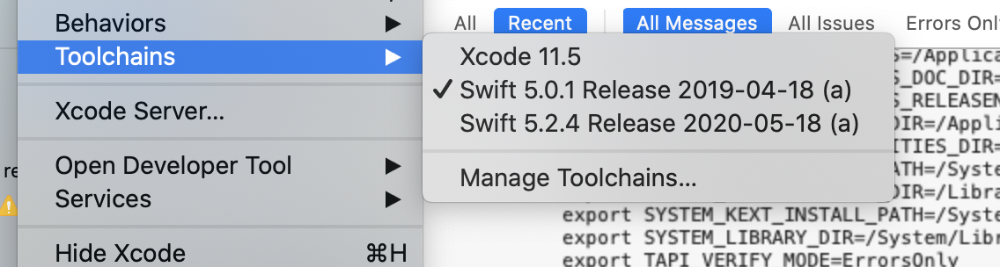

# Manage multiple Xcode versions

Sometimes you need to manage multiple Xcode versions, not simply update Xcode.

Usually Xcode is downloaded and updated from the App Store, but you can download several versions of Xcode and use them interchangeably.

Xcode manages the Swift version and the iOS SDK. Different projects may have different infrastructure dependencies. For example the Breville project, depends on a Swift version that one if its third-party SDK was compiled with.

Note, it is possible to run different Swift versions within an instance of Xcode, you may investigate [Toolchains](https://apple.stackexchange.com/questions/181472/is-it-possible-to-select-which-version-of-swift-to-use-in-xcode/239217#239217).



## Steps

1. Close Xcode if running

2. Download the Xcode version you need at [Apple Developer](https://developer.apple.com/download/more/?name=Xcode) (about 4GB), also download that version's Command Line Tools.

Once downloaded, double click the .xip to install, it will install in your Downloads directory.

Then add a new folder in Applications directory labelled `Xcode[version number]` and move the new Xcode.app inside of it. Expect:

```
/Applications/Xcode.app
/Applications/Xcode11.1/Xcode.app
```

3. Make sure you've installed the command line tools, by double-clicking the .dmg

4. Time to switch versions.

We need to explicitly do this to enable the correct Command Line Tools (`xcodebuild`). This basically updates the symbolic link for `xcodebuild` to `(xcode_install_directory)/usr/bin`.

Run:

```
sudo xcode-select --switch /Applications/Xcode11.1/Xcode.app
```

Check which Xcode is active:

```
xcode-select --print-path
```

Or:

```
xcodebuild -showsdks
```

5. When you open Xcode to work, be sure of course to open the correct application.

## References

- [Install Multiple Versions Of Xcode: Updated for Xcode 5 and Greater
  ](http://iosdevelopertips.com/xcode/install-multiple-versions-of-xcode.html)
